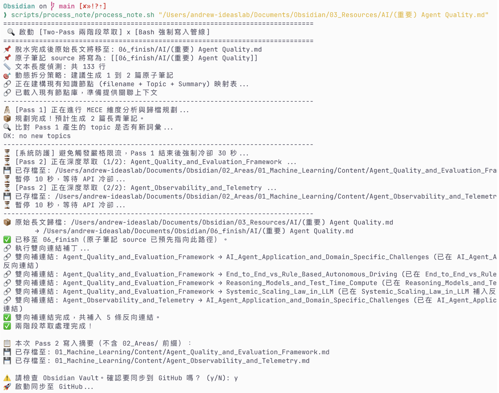
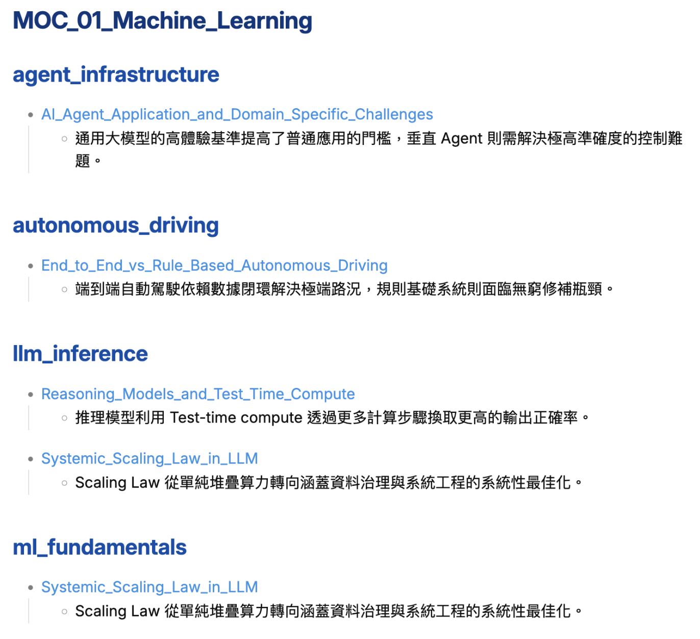
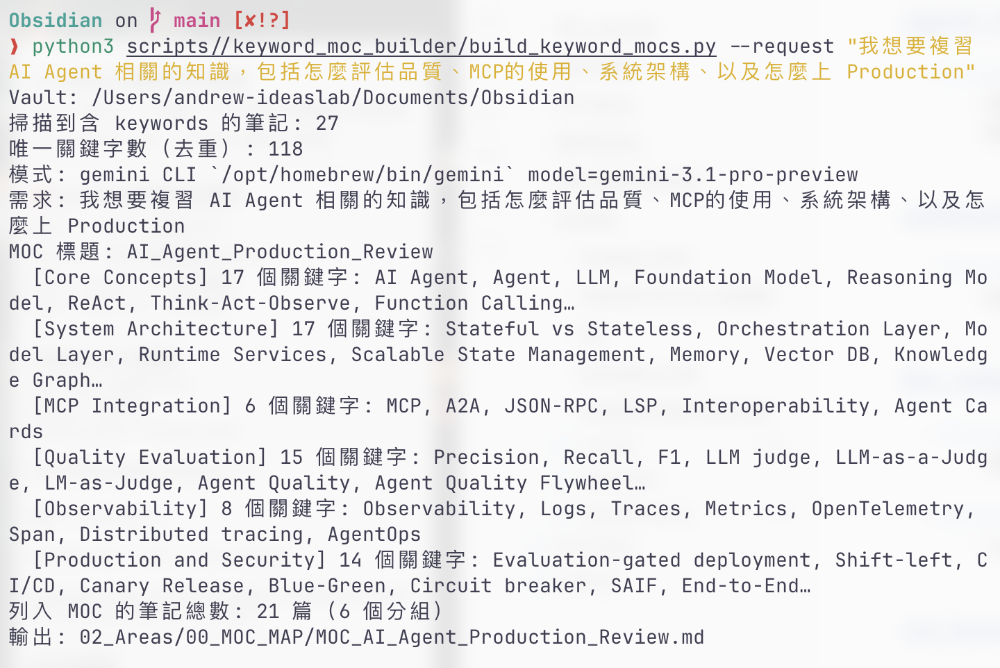
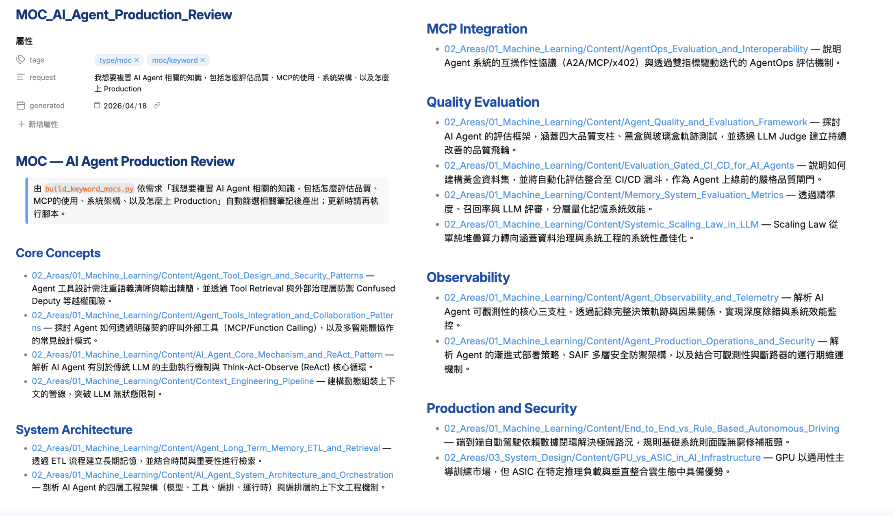

# Second Brain CLI Automation：知識重構與原子化萃取引擎

這是一套基於 **Gemini CLI**、**Bash** 與 **Obsidian DataviewJS** 的自動化知識萃取管線。核心價值是把 **HackMD 或長篇技術文檔** 做「知識脫水」與「結構重塑」，自動解構成符合 Zettelkasten 精神的原子化長青筆記；透過 Bash 強制掌控寫入與搬檔，讓格式與連結盡可能穩定。

> 怎麼跑、怎麼新增 MOC、腳本在哪：見 **[USAGE.md](USAGE.md)**。

---

## 專案初衷：從「靜態長文」到「動態大腦」

在資訊爆炸的開發生活裡，工具定位其實很不一樣：

- **HackMD（協作與展示）**：適合快速紀錄與團隊溝通，但線性階層很難變成可聯想的知識網。
- **Obsidian（個人第二大腦）**：適合長期累積，用雙向連結與圖譜模擬「怎麼想、怎麼回憶」。
- **AI 作為外接大腦**：為了消化大量舊筆記與長文遷移，這套管線把 **Gemini** 當成「擅長結構化與摘要的引擎」，但**寫入與檔案生命週期**仍交回腳本，避免模型越權動你的 Vault。

**為什麼用 Gemini（而且用 CLI）？**

- **推理與拆解**：Pass 1 要做 MECE 式切題、對齊自訂 topic 白名單，需要夠強的指令遵循與長文理解；Pass 2 要保留程式碼與細節，也要能照模板輸出。
- **與本機管線契合**：腳本用 **pipe** 把 prompt 交給 `gemini`，和你在終端機裡的工作流一致；不必把長文丟到瀏覽器裡分段複製。

---

## 快速開始：初始化空白 Vault

第一次使用時，執行 `scripts/init/` 的兩支腳本建立完整 Vault 結構：

```bash
# Step 1：建立 PARA 頂層資料夾（讀 scripts/config.yaml 的 vault_root）
bash scripts/init/init_vault.sh

# Step 2：編輯領域清單（填入你要建立的 02_Areas 領域，例：01_Machine_Learning）
vi scripts/init/areas.txt

# Step 3：建立 02_Areas 領域資料夾（含 Content/ 子資料夾）
bash scripts/init/init_areas.sh
```

兩支腳本均為冪等，重跑不會覆蓋已有資料夾。完成後即可開始使用 `process_note.sh` 等管線。

---

## 知識架構：PARA 分層與資料流

採用 PARA 分層與 Zettelkasten 思路，讓知識從「接收 → 處理 → 可查證」有一條清楚的路。整個 Vault 以數字前綴排序，分為**流動層**（接收與處理）、**沉澱層**（核心資產）、與**支援層**（素材、封存、暫存）：

**流動層（原料進、半成品出）**

- **`03_Resources`**：外部長文、講義、技術文檔等**原料**；可依主題分子資料夾（例如 `AI/`、`Backend/`）。Two-Pass 管線的入口。
- **`07_temp`**：**暫存工作區**，給正在處理、尚未決定最終落點的長文或半成品使用；類似「廚房流理台」，處理完就清空或搬走。
- **`06_finish`**：**已完成脫水**的長文歸檔區，由管線在跑完後自動把來源檔從 `03_Resources` 或 `07_temp` 搬進來，不必手動整理。

**沉澱層（長期資產）**

- **`02_Areas`**：要長期維護的核心能力與知識，底下再分領域資料夾與 `Content/`（原子筆記落點）；這是 Vault 的主體，MOC 織網發生在這一層。
- **`01_Projects`**：有明確死線或交付目標的短期專案（例如 LinkedIn 貼文、履歷、特定投稿）；完成後搬到 `04_Archive`。
- **`98 Books`**：書籍筆記與讀後整理；獨立於技術領域，用來累積閱讀脈絡與金句。

**支援層（週邊與素材）**

- **`05_Journal`**：每日日誌碎片（`YYYY-MM-DD.md`），快速記錄當天想法、靈感、待辦，之後可被萃取成 Area 筆記。
- **`04_Archive`**：冷封存，放已結案專案、過期內容或不再維護但需要保留的檔案。
- **`99_Attachments`**：所有圖片、截圖、PDF 等附件集中地，讓 Markdown 與附件解耦、方便備份與清理。

```
03_Resources/<主題>/長文.md
        ↓  process_note.sh
02_Areas/<Area>/Content/原子筆記_A.md
02_Areas/<Area>/Content/原子筆記_B.md
        ↓  (自動 mv)
06_finish/<主題>/長文.md
```

### `02_Areas` 領域一覽

| 資料夾 | 重點方向 |
|--------|----------|
| `00_MOC_MAP/` | 跨領域主題聚合（Keyword MOC、手寫 MOC） |
| `01_Machine_Learning/` | 傳統 ML／DL、LLM 與生成式 AI、Agent、RAG、評估與 Serving 等 |
| `02_Software_Engineering/` | 演算法、設計模式、API、後端框架、測試等 |
| `03_System_Design/` | 系統設計、分散式、Rate limiting、快取等 |
| `04_Cloud_and_DevOps/` | 雲端、K8s、CI/CD、可觀測性等 |
| `05_Database/` | 資料庫內部原理、建模、SQL/NoSQL 等 |
| `06_Security/` | 資安、密碼學、OWASP、雲端安全等 |
| `07_Web3_and_Blockchain/` | 區塊鏈、DeFi、合約等 |
| `08_Finance_and_Macro/` | 商業、總經、地緣、金融等 |
| `09_Life_and_Personal/` | 個人興趣、職涯、生活反思等 |

---

## 核心引擎：Two-Pass 萃取

管線以「兩階段」架構把 **LLM 的非確定性** 關在可預期的邊界裡：

**Pass 1（Planning）**：長文一次丟給模型做「藍圖」，輸出 MECE 拆解後的 JSON 陣列（檔名、領域、topic、摘要）。模型只思考，不碰任何檔案。

**Pass 2（Execution）**：依藍圖逐篇呼叫模型深度萃取內容；Bash／Python 負責目錄建立、JSON 驗證、YAML 截取、以及 `source` 強制覆寫——讓來源連結對齊脫水後的實際落點。

**職責分離原則**：模型只產文字；實體 I/O 全部由腳本掌控，不靠工具幻覺去動 Vault。

### 動態 MOC 織網（DataviewJS）

系統利用 DataviewJS 讀取筆記的 `up` 與 `topic`，動態產生二級標題分組。`topic` 支援 YAML list，同一篇可掛多個 topic、出現在多個分組下。每個 Area 下有 `MOC_*.md` 作為「索引目錄」；`00_MOC_MAP/` 下的 Keyword MOC 則像「需求驅動的主題播放清單」，面試前一行指令、幾秒完成。

**Keyword MOC 產生方式**：輸入自然語言需求（例如「我下週面試後端，想複習 Flask 和 PostgreSQL」），腳本從 vault 撈出所有 unique keywords，一次送給 Gemini CLI 做語意篩選與分組，最終以 Python 本地比對筆記並寫入 MOC — 整個過程約 ~1000 tokens，一次 API 呼叫。

---

## 工程亮點（為什麼這樣設計）

1. **LLM 動腦、Bash 動手**：非確定性的生成關在可預期的輸出格式裡；確定性的寫入與搬檔交給腳本。
2. **從物理檔案反向定義上下文**：掃描既有筆記的 topic / summary，讓 Pass 2 比較容易打出對的 `[[wikilink]]`。
3. **防彈清洗**：Pass 1 JSON 用 `json.loads` 驗證；Pass 2 處理 fence 與 YAML 起點，讓 Obsidian 儘量穩定索引。
4. **白名單自維護**：topic 白名單在 `system_rules.md` 裡，Pass 1 產出新 topic 時腳本會自動追加，保持一致性。
5. **主動回想**：筆記模板要求生成情境式問題，讓筆記不只存檔，還能當面試演練素材。
6. **Provider 抽象層（`lib/llm_runner.py`）**：Gemini CLI 與 Claude Code 共用同一個呼叫介面，切換 provider 不需動任何 prompt 或上層邏輯；provider 差異（命令格式、錯誤訊號字串）全隔離在 runner 裡。
7. **配額 Retry + stderr 雜訊過濾**：Gemini 的 Gaxios／Keychain 雜訊、Claude 的 overloaded 都有各自的 pattern；只有真正的限流才觸發最多五次重試，其餘錯誤直接拋出，不掩蓋問題。
8. **三層設定繼承鏈（`lib/pipeline_config.py`）**：`pipeline.model` → `provider.model` → 硬編 fallback；各管線可獨立切換 provider，互不干擾，同時不需為每個管線重複設定。
9. **行數啟發式推算 MECE 粒度**：Pass 1 前先算原稿行數（< 150 行 → 1–2 篇、> 1600 行 → 12–18 篇），把 `EXPECTED_NOTES` 範圍注入 prompt，讓模型在做 MECE 拆解時有量化錨點，而非任意分割。
10. **Frontmatter 強制覆寫（`enforce_yaml_source.py`）**：Pass 2 生成後，Bash 計算好的 `up`、`source`、`note_type` 強制寫入 YAML，模型不可能亂填影響 Vault 索引；即使模型幻覺也不會存活到筆記裡。
11. **雙向連結回補（`patch_connections.py`）**：寫完新筆記後，從「相關知識連結」區段抓出所有 `[[wikilink]]`，反向找到目標筆記並注入互補 backlink；避免單向死連，讓圖譜結構真正雙向。
12. **`@` 遮蔽防注入**：使用者內容（長文、逐字稿、keywords）送入 CLI 前，所有 `@` 替換為全形 `＠`，防止 CLI 把任何使用者文字誤判成 `@filepath` 語法；輸出後再 `sed` 還原，不影響模型產出。
13. **Append 模式 + 課程 PDF 跨階段引用**：`process_course.sh` Step 2 以 append 寫入，任一段失敗不影響已完成段落，可直接重跑剩餘部分；PDF 投影片路徑注入兩個階段的 prompt，讓結構摘要與內容展開都能對照投影片。
14. **Source path 預先計算 → 再搬檔**：`process_note.sh` 在搬動原始檔至 `06_finish` 之前先算好 `SOURCE_REL_PATH`，確保 `source:` wikilink 指向搬後的最終路徑，而非暫時位置。
15. **Dry-run 跨工具一致**：`keyword_moc_builder` 與 `rewrite_note_sources` 均支援 `--dry-run`，輸出完整預覽但不寫入 Vault；相同旗標名稱、相同語意，降低多工具組合使用的認知摩擦。

---

## User Case：面試準備與「重構即學習」

**重構的過程本身就是學習。** 腳本跑完後，人工審閱原子筆記的切分與用詞，往往比單純收藏長文更有記憶留存。

從 HackMD 匯入一篇關於「分散式系統可觀測性」的長文，脫水後可能同時落在 `04_Cloud_and_DevOps`、`03_System_Design` 等不同 area。面試前不必再翻原始長文，直接打開對應 MOC，用 topic 分組快速掃過實作細節與摘要。

---

## Demo：實際執行展示

### `process_note.sh`：長文脫水流程

執行過程（Pass 1 → Pass 2 拆解原子筆記）：



執行完成後，Obsidian MOC 自動聚合結果：



### `keyword_moc.sh`：Keyword MOC 產生流程

輸入自然語言需求，Gemini CLI 進行語意篩選：



產出的 Keyword MOC（依主題分組，含 wikilink）：



### 脫水後的原子筆記範例

`process_note.sh` 跑完後實際產出的筆記，見 [Demo(Process_note)/](<Demo(Process_note)/>)，裡面包含三篇由長文脫水出來的原子筆記（YAML frontmatter、摘要、情境問題均已填入）。

---

_Last Updated: 2026-04-04_
