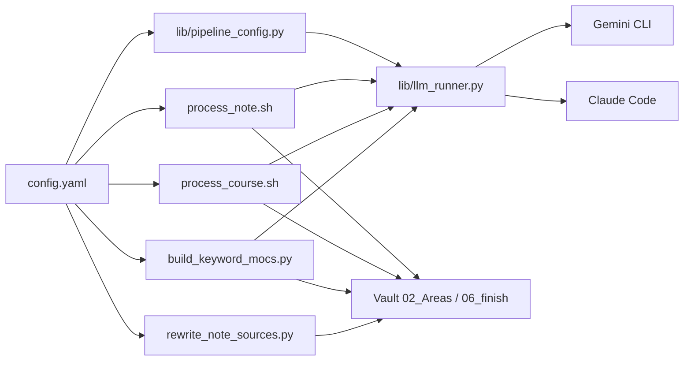

# Scripts 管線總覽

本目錄收錄 Obsidian vault 的自動化管線：長文原子化、課程逐字稿筆記、Keyword MOC 聚合、以及歸檔後的 `source` 連結修正。所有管線共用 **[`config.yaml`](config.yaml)** 作為單一設定入口，並透過 **[`lib/llm_runner.py`](lib/llm_runner.py)** 抽象層支援 **Gemini CLI** 與 **Claude Code** 雙 provider。

## 依賴

| 項目 | 用途 |
|------|------|
| **Gemini CLI** *或* **Claude Code** | LLM 呼叫端（擇一即可；路徑與 provider 設定於 `config.yaml`） |
| **Python 3.10+** | `pipeline_config.py`、`llm_runner.py`、各 `lib/*.py`、Python 管線 |
| **`jq`** | Bash 管線解析 JSON（`course_note`、`process_note`） |
| **PyYAML** | 見根目錄 [`requirements.txt`](requirements.txt) |

## 設定檔

- **[`config.yaml`](config.yaml)**：`vault_root`、`llm`（provider）、`gemini`、`claude`、以及各子區塊 `process_note`、`course_note`、`keyword_moc`、`rewrite_note_sources`。
- 共用載入器：[`lib/pipeline_config.py`](lib/pipeline_config.py)（Bash 以 `python3 ... pipeline_config.py <config> <pipeline> <key>` 取值）。

### config.yaml 完整 schema（重要欄位）

```yaml
llm:
  provider: "gemini"          # 全域預設：gemini | claude

gemini:
  bin: "/opt/homebrew/bin/gemini"
  model: "gemini-3.1-pro-preview"
  fallback_model: "gemini-2.5-pro"

claude:
  bin: ""                     # 留空 → 自動探 PATH
  model: "claude-opus-4-7"
  fallback_model: ""
  extra_flags: "--max-turns 1"

process_note:
  # provider: ""              # 留空繼承 llm.provider；填入則只此管線切換
  model: ""                   # 留空繼承 <provider>.model
  cooldown_after_pass1: 30
  cooldown_between_pass2: 10
```

各管線均可用 `provider:` 獨立覆寫，不影響其他管線。

## LLM 抽象層

### `lib/llm_runner.py`

所有 bash 腳本與 Python 管線的統一 LLM 出口。

**Python import**：
```python
from llm_runner import run_llm
output = run_llm(prompt, provider="claude", bin_path="/opt/homebrew/bin/claude",
                 model="claude-opus-4-7", extra_flags="--max-turns 1")
```

**CLI（bash 呼叫）**：
```bash
echo "$PROMPT" | python3 scripts/lib/llm_runner.py \
    --provider gemini \
    --bin /opt/homebrew/bin/gemini \
    --model gemini-3.1-pro-preview
```

| 參數 | 說明 |
|------|------|
| `--provider` | `gemini` \| `claude` |
| `--bin` | CLI 執行檔絕對路徑 |
| `--model` | 模型名稱字串 |
| `--timeout` | 逾時秒數（預設 600） |
| `--extra-flags` | 傳給 CLI 的額外旗標（Claude 用 `--max-turns 1`） |
| `--max-retries` | 配額錯誤最大重試次數（預設 5） |
| `--retry-sleep` | 重試間隔秒數（預設 120） |

**Provider 差異對照**：

| 行為 | Gemini CLI | Claude Code |
|------|-----------|-------------|
| 基礎命令 | `gemini --model X` | `claude -p --model X [extra_flags]` |
| stdin | prompt 直接傳入 | 同 |
| PDF 引用 | `@path/to/file` in prompt | `@path/to/file` in prompt（原生支援） |
| @ 遮蔽 | 需要（使用者內容） | 同（CLI 均支援 @ 語法） |
| 配額 retry 偵測 | `quota`、`AbortError`、`429` | `rate_limit`、`overloaded`、`429` |

**Retry 策略**：遇配額 / rate-limit 錯誤時自動重試，最多 5 次，每次間隔 120s。

### `lib/pipeline_config.py`

設定載入器，供 bash（subprocess CLI）與 Python（import）共用。

**重要函式**：

| 函式 | 說明 |
|------|------|
| `resolve_provider(cfg, pipeline)` | 管線 provider → 全域 llm.provider → `"gemini"` |
| `resolve_llm_bin(cfg, provider)` | 依 provider 找可用 CLI 執行檔 |
| `resolve_llm_model(cfg, pipeline, provider)` | 管線 model → provider 全域 model |
| `resolve_llm_fallback_model(...)` | 同上，針對 fallback_model |
| `resolve_llm_extra_flags(cfg, provider)` | 讀取 extra_flags（Claude 用） |
| `resolve_vault_root(config_path, cfg)` | vault 路徑（設定值 or 推導） |
| `expand_for_keyword_moc(config_path, cfg)` | 轉換成 build_keyword_mocs.py 格式 |

**CLI 可用 key**（`pipeline_config.py <config> <pipeline> <key>`）：

```
vault_root | provider | llm_bin | llm_model | llm_fallback_model | llm_extra_flags |
gemini_bin（向後相容）| model（向後相容）| fallback_model（向後相容）|
cooldown_after_pass1 | cooldown_between_pass2 | cooldown_after_step1 |
cooldown_between_step2 | retry_cooldown
```

## 子專案索引

| 資料夾 | 說明 |
|--------|------|
| [`init/`](init/) | Vault 一鍵初始化：建立 PARA 資料夾結構與 `02_Areas` 領域 |
| [`lib/`](lib/) | 全域工具：`pipeline_config.py`、`llm_runner.py` |
| [`process_note/`](process_note/README.md) | 長文 Two-Pass 原子化 → `02_Areas` |
| [`course_note/`](course_note/README.md) | 逐字稿兩階段課程筆記 → 同資料夾 `note.md` |
| [`keyword_moc_builder/`](keyword_moc_builder/README.md) | 依自然語意聚合 keywords 產出 MOC |
| [`rewrite_note_sources/`](rewrite_note_sources/README.md) | 批次修正 `02_Areas` 筆記 `source:` wikilink（無 LLM 呼叫） |

## 管線關係（高階）



## Prompt 模板機制（共通）

`course_note` 與 `process_note` 的提示詞為**純文字檔**；由 **Bash** 讀入後以字串替換（例如 `${VAR//pattern/rep}`）填入 placeholder，再 **pipe 至 `llm_runner.py`**，並非在執行期使用獨立「模板引擎」或 `import` 模板。

Prompt 模板與 LLM provider 完全解耦，切換 provider 不需修改任何 prompt 檔案。

## @ 遮蔽（共通安全機制）

**使用者內容**（`FILE_CONTENT`、`TRANSCRIPT_CONTENT`、keywords）中的 `@` 在送入前替換為全形 `＠`，防止 CLI 把使用者文字誤判為檔案路徑注入。模型輸出後再以 `sed 's/＠/@/g'` 還原。

**意圖性 `@pdf_path`**（PDF 引用）由 `process_course.sh` 直接構建，不受遮蔽影響。Gemini 與 Claude 均原生支援此語法。
